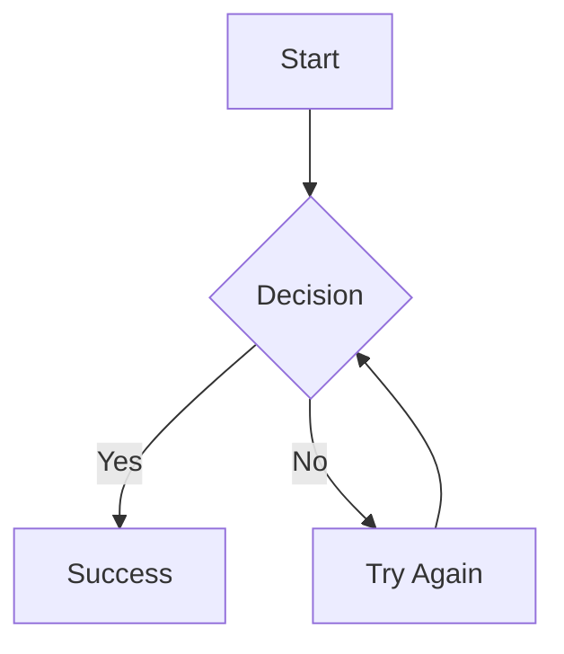

# DataKnobs Markdown Tools

Convert Markdown files with Mermaid diagrams to beautiful PDF and HTML documents.

## Features

- 📝 **Full Markdown Support** - All standard Markdown features
- 📊 **Mermaid Diagrams** - Flowcharts, sequence diagrams, Gantt charts, and more
- 🎨 **Multiple Themes** - GitHub, Academic, and Minimal styles
- 📄 **Multiple Formats** - Generate PDF and HTML outputs
- 🐳 **Docker Support** - Run without installing dependencies
- 🚀 **Fast & Lightweight** - Efficient conversion pipeline
- 📚 **Table of Contents** - Auto-generated TOC support
- 🎯 **Self-Contained HTML** - Embedded images for portable documents

## Quick Start

### Option 1: Docker (Recommended - Single Dependency)

**🐳 Docker Hub: Coming Soon!** The official Docker image will be available at `dataknobs/md-tools`.

For now, build locally:
```bash
# Clone and build the image locally
git clone https://github.com/KBS-Labs/dataknobs-md-tools
cd dataknobs-md-tools
docker build -t dataknobs/md-tools -f docker/Dockerfile .

# Convert markdown to PDF
docker run --rm -v $(pwd):/workspace dataknobs/md-tools input.md output.pdf

# Convert markdown to HTML (self-contained by default)
docker run --rm -v $(pwd):/workspace dataknobs/md-tools -f html input.md output.html
```

### Option 2: Native Installation

```bash
# Clone the repository
git clone https://github.com/KBS-Labs/dataknobs-md-tools
cd dataknobs-md-tools

# Install dependencies (installs uv, pandoc, Node.js, mermaid-cli, Python deps)
./native/install.sh

# Convert markdown to PDF
./native/dk-md2pdf input.md output.pdf

# Convert markdown to HTML (self-contained by default)
./native/dk-md2pdf -f html input.md output.html
```

## Installation

### Docker Method

Requires only Docker installed on your system:

```bash
# Clone and build locally (Docker Hub coming soon!)
git clone https://github.com/KBS-Labs/dataknobs-md-tools
cd dataknobs-md-tools
docker build -t dataknobs/md-tools -f docker/Dockerfile .
```

### Native Method

Simple automated installation using `uv` for Python dependency management:

```bash
# Clone repository
git clone https://github.com/KBS-Labs/dataknobs-md-tools
cd dataknobs-md-tools

# Run installer (supports macOS, Linux)
# Installs: uv, pandoc, Node.js, mermaid-cli, and Python dependencies
./native/install.sh

# Add to PATH (optional)
export PATH="$PATH:$(pwd)/native"
```

The installer automatically:
- Installs **uv** (Python package manager)
- Installs **pandoc**, **Node.js**, and **mermaid-cli**
- Installs Python 3.11.9 and **weasyprint** via `uv`
- Handles all system dependencies for your OS

#### Manual Installation

If the installer doesn't work for your system:

**System Dependencies:**
1. **uv**: `curl -LsSf https://astral.sh/uv/install.sh | sh`
2. **Pandoc**: https://pandoc.org/installing.html
3. **Node.js & npm**: https://nodejs.org/
4. **Mermaid CLI**: `npm install -g @mermaid-js/mermaid-cli`

**Python Dependencies:**
```bash
# From project root
uv sync
```

That's it! `uv` automatically installs the correct Python version and all dependencies.

## Usage

### Command Line Interface

```bash
dk-md2pdf [OPTIONS] input.md [output]
```

**Output Format Auto-Detection**: The tool automatically detects the output format based on file extension:
- `.html` or `.htm` → HTML output
- `.pdf` or no extension → PDF output
- Use `-f` flag to override auto-detection

#### Options

| Option | Description | Default |
|--------|-------------|---------|
| `-h, --help` | Show help message | - |
| `-f, --format` | Force output format: `pdf` or `html` | auto-detect |
| `-t, --theme` | CSS theme: `github`, `academic`, `minimal` | `github` |
| `--toc` | Include table of contents | disabled |
| `--no-mermaid` | Skip Mermaid diagram processing | disabled |
| `--standalone` | Create self-contained HTML with embedded CSS | disabled |
| `--keep-html` | When generating PDF, also save intermediate HTML | disabled |
| `--keep-svgs` | Keep SVG files as external files (HTML only) | embed in HTML |
| `-v, --verbose` | Enable verbose output | disabled |

### Examples

```bash
# Basic conversion (creates input.pdf)
dk-md2pdf input.md

# Auto-detect format from extension
dk-md2pdf input.md output.html    # Creates HTML
dk-md2pdf input.md output.pdf     # Creates PDF

# Generate both PDF and HTML in one run
dk-md2pdf --keep-html input.md output.pdf

# HTML with external SVG files (not embedded)
dk-md2pdf --keep-svgs input.md output.html

# Academic style with TOC
dk-md2pdf -t academic --toc paper.md

# Self-contained HTML with embedded CSS and images
dk-md2pdf --standalone --toc report.md report.html
```

### Global Installation

```bash
# Using symlink (Unix/Linux/macOS)
sudo ln -s $(pwd)/bin/dk-md2pdf /usr/local/bin/dk-md2pdf
sudo ln -s $(pwd)/bin/dk-md2html /usr/local/bin/dk-md2html

# Using alias
echo 'alias dk-md2pdf="'$(pwd)'/bin/dk-md2pdf"' >> ~/.bashrc
echo 'alias dk-md2html="'$(pwd)'/bin/dk-md2html"' >> ~/.bashrc
source ~/.bashrc
```

## Themes

### GitHub (Default)
Clean, modern style similar to GitHub's markdown rendering. Perfect for technical documentation and README files.

### Academic
Professional appearance suitable for papers, reports, and formal documents. Features serif fonts and formal formatting.

### Minimal
Simple, distraction-free design focusing on readability. Ideal for basic documents and printing.

## HTML Output Features

### Self-Contained Documents

By default, HTML output creates fully self-contained documents:
- **Embedded Images**: All Mermaid diagrams are embedded as base64 data URIs
- **No External Files**: Single HTML file contains everything
- **Portable**: Share or email the HTML file without attachments
- **Clean Directories**: No SVG files cluttering your output folder

To keep SVG files as separate external files (previous behavior):
```bash
dk-md2pdf --keep-svgs input.md output.html
```

### Dual Output Generation

Generate both PDF and HTML in a single command:
```bash
dk-md2pdf --keep-html input.md output.pdf
# Creates: output.pdf and output.html
```

## Mermaid Diagram Support

All Mermaid diagram types are supported:

- Flowcharts
- Sequence diagrams
- Class diagrams
- State diagrams
- Entity Relationship diagrams
- Gantt charts
- Pie charts
- Git graphs
- User journey maps

Example:

````markdown

````

## CI/CD Integration

### GitHub Actions

```yaml
name: Generate PDFs
on: push

jobs:
  convert:
    runs-on: ubuntu-latest
    steps:
      - uses: actions/checkout@v3
      - run: docker pull dataknobs/md-tools
      - run: |
          for file in docs/*.md; do
            docker run --rm -v $(pwd):/workspace \
              dataknobs/md-tools "$file"
          done
      - uses: actions/upload-artifact@v3
        with:
          name: pdfs
          path: docs/*.pdf
```

### GitLab CI

```yaml
generate-docs:
  image: dataknobs/md-tools
  script:
    - dk-md2pdf --toc README.md documentation.pdf
  artifacts:
    paths:
      - documentation.pdf
```

## Programmatic Usage

### Python

```python
import subprocess

def convert_markdown(input_file, output_file, theme='github'):
    subprocess.run([
        'docker', 'run', '--rm',
        '-v', f'{os.getcwd()}:/workspace',
        'dataknobs/md-tools',
        '--theme', theme,
        input_file, output_file
    ], check=True)
```

### Node.js

```javascript
const { exec } = require('child_process');

function convertMarkdown(input, output, theme = 'github') {
    return new Promise((resolve, reject) => {
        exec(`dk-md2pdf --theme ${theme} ${input} ${output}`,
            (error, stdout, stderr) => {
                if (error) reject(error);
                else resolve(output);
            });
    });
}
```

## Troubleshooting

### Docker Issues

```bash
# Check Docker is running
docker info

# Build image locally if pull fails
docker build -t dataknobs/md-tools -f docker/Dockerfile .

# Run with more memory if needed
docker run --rm -m 1g -v $(pwd):/workspace dataknobs/md-tools input.md
```

### Native Installation Issues

```bash
# Check installed dependencies
which pandoc mmdc weasyprint

# Reinstall specific component
npm install -g @mermaid-js/mermaid-cli
pip install --upgrade weasyprint

# Use verbose mode for debugging
dk-md2pdf -v input.md
```

### Mermaid Rendering Issues

**Mermaid processing failed warning?** This usually indicates a parsing error in your Mermaid diagrams.

To diagnose the issue:
```bash
# Use verbose mode to see the actual error
dk-md2pdf -v input.md output.html
```

Common issue: **"Lexical error" or "Unrecognized text" errors**

If you see errors like `Lexical error on line X. Unrecognized text`, especially with `<br/>` tags, the issue is that Mermaid requires node labels containing special characters to be quoted.

**Solution**: Wrap all node labels containing `<br/>` or other special characters in double quotes:

```diff
# ❌ This will fail:
- NodeName[Label with<br/>line break]
+ # ✅ This will work:
+ NodeName["Label with<br/>line break"]

# ❌ This will fail for database nodes:
- DB[(Database<br/>PostgreSQL)]
+ # ✅ This will work:
+ DB[("Database<br/>PostgreSQL")]
```

**Missing text in diagrams?** Run the font fix:
```bash
./native/fix-fonts.sh
```

For other mermaid issues:

- Ensure diagrams are in proper mermaid code blocks
- Check mermaid syntax at https://mermaid.live
- Use `--no-mermaid` flag to skip diagram processing

## Project Structure

```
dataknobs-md-tools/
├── bin/                    # User-facing scripts
│   ├── dk-md2pdf          # Main converter
│   └── dk-md2html         # HTML converter alias
├── native/                # Native installation
│   ├── dk-md2pdf          # Core conversion script
│   └── install.sh         # Dependency installer
├── docker/                # Docker implementation
│   ├── Dockerfile         # Container definition
│   └── docker-entrypoint.sh
├── src/                   # Core resources
│   ├── templates/         # HTML templates
│   │   └── styles/        # CSS themes
│   └── config/            # Configuration files
├── examples/              # Sample documents
└── tests/                 # Test files
```

## Contributing

Contributions are welcome! Please feel free to submit a Pull Request.

1. Fork the repository
2. Create your feature branch (`git checkout -b feature/amazing-feature`)
3. Commit your changes (`git commit -m 'Add amazing feature'`)
4. Push to the branch (`git push origin feature/amazing-feature`)
5. Open a Pull Request

## License

MIT License - see [LICENSE](LICENSE) file for details.

## Credits

Built with:
- [Pandoc](https://pandoc.org/) - Universal document converter
- [Mermaid](https://mermaid-js.github.io/) - Diagram and chart generation
- [WeasyPrint](https://weasyprint.org/) - HTML/CSS to PDF converter

Part of the [DataKnobs](https://github.com/KBS-Labs) ecosystem.

## Support

- 📧 Email: support@kbs-labs.com
- 🐛 Issues: [GitHub Issues](https://github.com/KBS-Labs/dataknobs-md-tools/issues)
- 💬 Discussions: [GitHub Discussions](https://github.com/KBS-Labs/dataknobs-md-tools/discussions)
