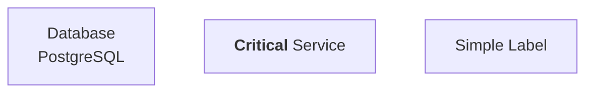
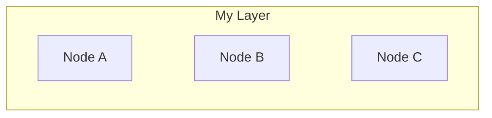
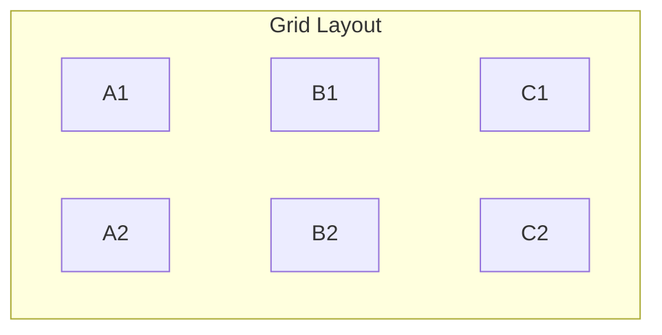
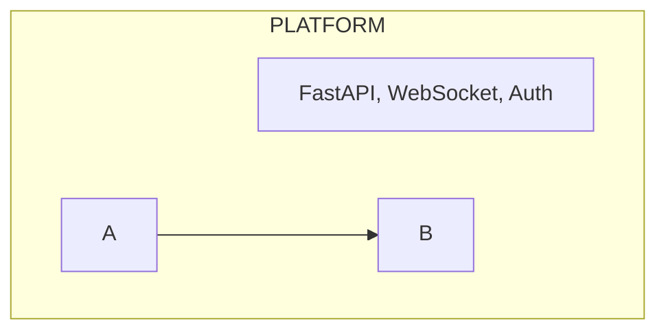
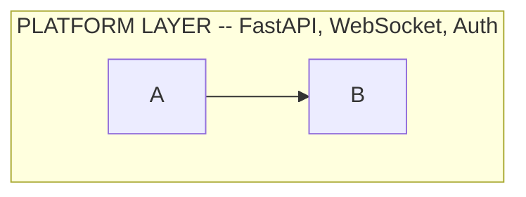

# Mermaid Diagram Authoring Guide

Tips, patterns, and known limitations for writing Mermaid diagrams in
DataKnobs Markdown Tools.

## Supported Diagram Types

All standard Mermaid diagram types are supported:

- Flowcharts (`graph` / `flowchart`)
- Sequence diagrams
- Class diagrams
- State diagrams
- Entity Relationship diagrams
- Gantt charts
- Pie charts
- Git graphs
- User journey maps
- XY charts

## Per-Diagram Fallback Rendering

When your document contains multiple Mermaid diagrams, the tool first attempts
to render all diagrams in a single pass (fast path). If that fails, it
automatically falls back to rendering each diagram independently.

This means **one broken diagram won't prevent the others from rendering**.
Successfully rendered diagrams appear as SVGs, while failed diagrams are
preserved as code blocks with an error annotation showing what went wrong.

Use verbose mode (`-v`) to see which diagrams succeeded and which failed.

## HTML Labels

Mermaid supports HTML formatting in node labels when `htmlLabels` is enabled
(the default in this project). This allows:

- Line breaks: `Node["Line 1<br/>Line 2"]`
- Bold text: `Node["<b>Important</b> note"]`
- Italic text: `Node["<i>Emphasis</i> here"]`

**Important:** Node labels containing HTML tags or special characters must be
wrapped in double quotes:



Without quotes, Mermaid will throw a lexical error on `<br/>` and similar tags.

## Known Limitations

### `direction LR` Ignored in Subgraphs

**Status:** Upstream Mermaid limitation (affects all Mermaid installations)

The `direction LR` directive inside subgraphs of a `flowchart TB` diagram is
silently ignored -- all child nodes stack vertically regardless.

**Workaround:** Use invisible links (`~~~`) to force horizontal layout:



For multi-row grids, chain each row separately:



### Subgraph Title Wrapping Ignores Content Width

**Status:** Upstream bug ([mermaid-js/mermaid#6110](https://github.com/mermaid-js/mermaid/issues/6110))

Subgraph titles use a hardcoded pixel width for text wrapping, ignoring both
the `wrappingWidth` configuration setting and the actual rendered width of the
subgraph content. This causes long titles to wrap prematurely.

The following mitigations have been tested and have **no effect**:
- Widening inner node labels to force a wider content bounding box
- Per-diagram frontmatter config (`useMaxWidth: false`, `wrappingWidth: 400`)
- Global `wrappingWidth` setting in `mermaid-config.json`

**Workaround:** Keep subgraph titles short (~20-25 characters). Move
descriptive text into child nodes instead:



Instead of:



## Common Errors

### Lexical Error with Special Characters

If you see `Lexical error on line X. Unrecognized text`, wrap node labels
containing special characters in double quotes:

```diff
- NodeName[Label with<br/>line break]
+ NodeName["Label with<br/>line break"]

- DB[(Database<br/>PostgreSQL)]
+ DB[("Database<br/>PostgreSQL")]
```

### Diagram Fails but Others Render

This is the per-diagram fallback in action. Check verbose output (`-v`) for
the specific error message. The failed diagram's code is preserved in the
output with an error annotation so you can fix it.

### Missing Text in Diagrams

Font issues can cause text to disappear from rendered diagrams. Run the font
fix script:

```bash
./native/fix-fonts.sh
```

## Validating Diagrams

Before committing, you can validate Mermaid syntax at
[mermaid.live](https://mermaid.live). Paste your diagram code to check for
syntax errors interactively.
