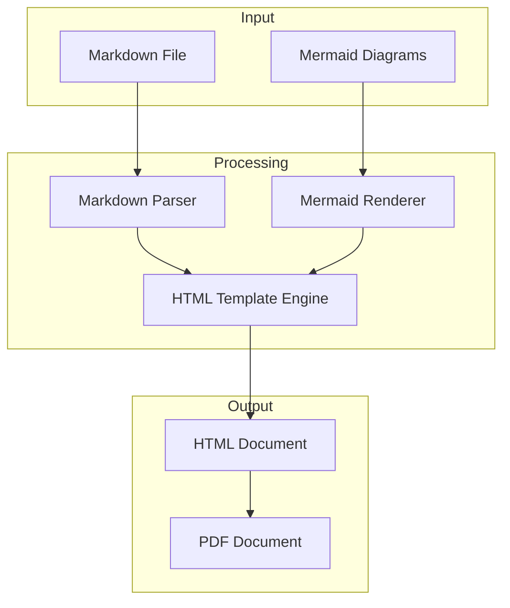
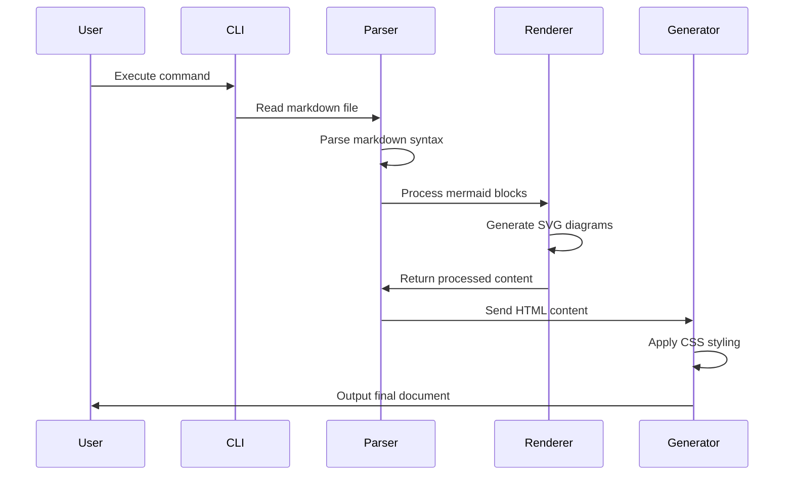
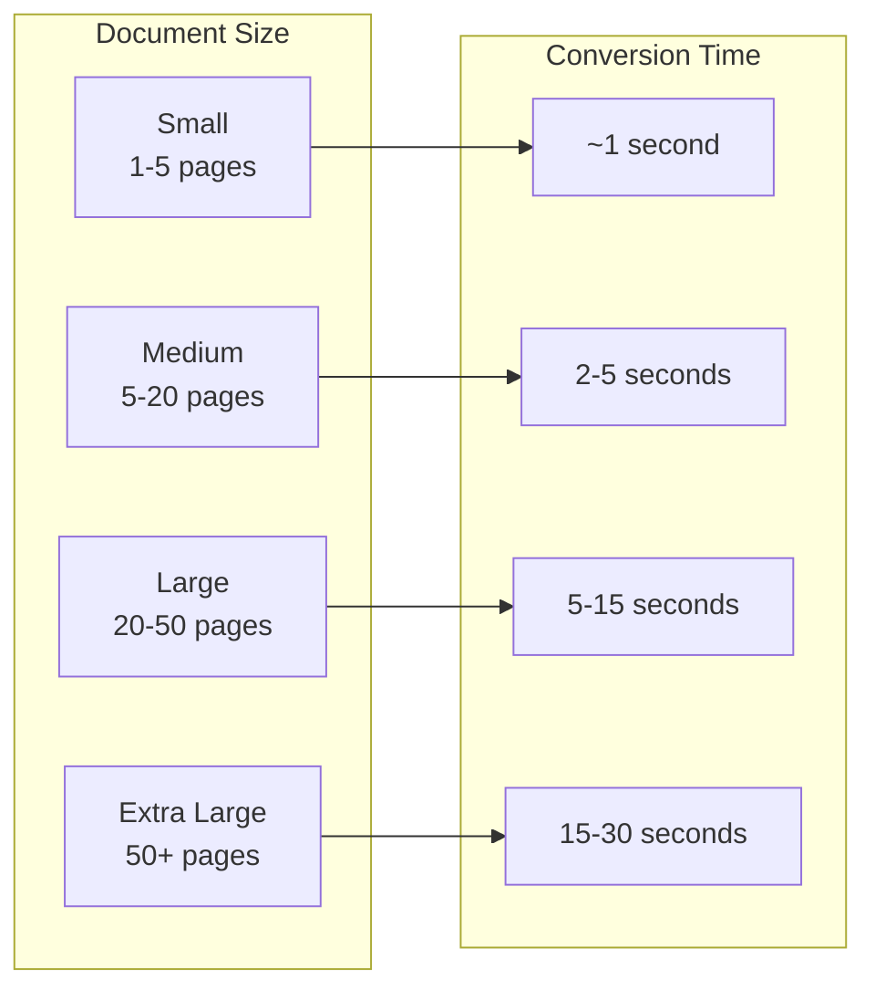
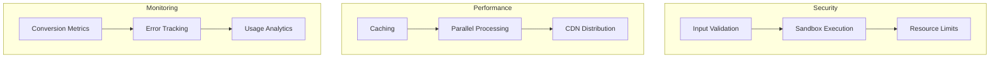

# Introduction

This document demonstrates the full capabilities of the DataKnobs Markdown Tools, including advanced formatting, Mermaid diagrams, and various content types suitable for technical documentation.

## Table of Contents

1. [System Architecture](#system-architecture)
2. [API Documentation](#api-documentation)
3. [Data Flow](#data-flow)
4. [Code Examples](#code-examples)
5. [Performance Metrics](#performance-metrics)
6. [Deployment Guide](#deployment-guide)

## System Architecture

The DataKnobs Markdown Tools follow a modular architecture designed for flexibility and extensibility.



### Core Components

| Component | Technology | Purpose |
|-----------|------------|---------|
| Parser | Pandoc | Markdown to HTML conversion |
| Diagram Renderer | Mermaid CLI | Convert diagrams to SVG |
| PDF Generator | WeasyPrint | HTML to PDF conversion |
| Template Engine | Pandoc Templates | Customizable output styling |

## API Documentation

### Conversion API

The tool provides a simple command-line interface for document conversion.

```bash
# Basic usage
dk-md2pdf input.md output.pdf

# With options
dk-md2pdf --theme academic --toc input.md output.pdf
```

#### Parameters

| Parameter | Type | Default | Description |
|-----------|------|---------|-------------|
| `--format` | string | `pdf` | Output format (`pdf` or `html`) |
| `--theme` | string | `github` | CSS theme to apply |
| `--toc` | boolean | `false` | Include table of contents |
| `--standalone` | boolean | `false` | Create self-contained HTML |

### Programmatic Usage

```python
import subprocess

def convert_markdown(input_file, output_file, theme='github'):
    """Convert markdown to PDF with specified theme."""
    cmd = [
        'dk-md2pdf',
        '--theme', theme,
        input_file,
        output_file
    ]
    subprocess.run(cmd, check=True)

# Example usage
convert_markdown('report.md', 'report.pdf', theme='academic')
```

## Data Flow

The conversion process follows a pipeline architecture:



## Code Examples

### JavaScript Integration

```javascript
const { exec } = require('child_process');
const path = require('path');

class MarkdownConverter {
    constructor(options = {}) {
        this.theme = options.theme || 'github';
        this.format = options.format || 'pdf';
    }

    async convert(inputPath, outputPath) {
        return new Promise((resolve, reject) => {
            const cmd = `dk-md2pdf --theme ${this.theme} --format ${this.format} ${inputPath} ${outputPath}`;

            exec(cmd, (error, stdout, stderr) => {
                if (error) {
                    reject(error);
                } else {
                    resolve(outputPath);
                }
            });
        });
    }
}

// Usage
const converter = new MarkdownConverter({ theme: 'minimal' });
await converter.convert('input.md', 'output.pdf');
```

### Python Wrapper

```python
import os
import subprocess
from pathlib import Path
from typing import Optional, List

class DataKnobsConverter:
    """Wrapper for DataKnobs Markdown Tools."""

    def __init__(self, docker: bool = True):
        """Initialize converter.

        Args:
            docker: Use Docker version if True, native if False
        """
        self.docker = docker
        self.base_cmd = 'dk-md2pdf'
        if docker:
            self.base_cmd += ' --use-docker'

    def convert(
        self,
        input_file: Path,
        output_file: Optional[Path] = None,
        format: str = 'pdf',
        theme: str = 'github',
        toc: bool = False,
        **kwargs
    ) -> Path:
        """Convert markdown file to specified format.

        Args:
            input_file: Path to input markdown file
            output_file: Path to output file (optional)
            format: Output format ('pdf' or 'html')
            theme: CSS theme to use
            toc: Include table of contents

        Returns:
            Path to generated output file
        """
        if not output_file:
            output_file = input_file.with_suffix(f'.{format}')

        cmd = [
            self.base_cmd,
            '--format', format,
            '--theme', theme
        ]

        if toc:
            cmd.append('--toc')

        cmd.extend([str(input_file), str(output_file)])

        subprocess.run(' '.join(cmd), shell=True, check=True)
        return output_file
```

## Performance Metrics

### Conversion Benchmarks

The following table shows typical conversion times for different document sizes:



| Document Size | Pages | Mermaid Diagrams | Conversion Time |
|--------------|-------|------------------|-----------------|
| Small | 1-5 | 0-2 | ~1 second |
| Medium | 5-20 | 3-5 | 2-5 seconds |
| Large | 20-50 | 5-10 | 5-15 seconds |
| Extra Large | 50+ | 10+ | 15-30 seconds |

### Resource Usage

- **Memory**: 50-200 MB depending on document complexity
- **CPU**: Single-threaded, minimal CPU usage
- **Disk**: Temporary files cleaned up automatically

## Deployment Guide

### Docker Deployment

```dockerfile
# Multi-stage build for optimization
FROM node:20-slim as builder
WORKDIR /build
COPY package*.json ./
RUN npm ci --only=production

FROM node:20-slim
RUN apt-get update && apt-get install -y \
    pandoc \
    python3-pip \
    && pip3 install weasyprint \
    && rm -rf /var/lib/apt/lists/*

COPY --from=builder /build/node_modules /app/node_modules
COPY . /app
WORKDIR /app

ENTRYPOINT ["./dk-md2pdf"]
```

### CI/CD Integration

```yaml
# GitHub Actions Example
name: Generate Documentation
on:
  push:
    paths:
      - 'docs/**/*.md'

jobs:
  build-docs:
    runs-on: ubuntu-latest
    steps:
      - uses: actions/checkout@v3

      - name: Pull converter image
        run: docker pull dataknobs/md-tools

      - name: Convert documentation
        run: |
          for file in docs/*.md; do
            docker run --rm -v $(pwd):/workspace \
              dataknobs/md-tools "$file"
          done

      - name: Upload PDFs
        uses: actions/upload-artifact@v3
        with:
          name: documentation
          path: docs/*.pdf
```

### Production Considerations



1. **Security**
   - Validate input files before processing
   - Run conversions in sandboxed environment
   - Implement resource limits to prevent DoS

2. **Performance**
   - Cache frequently used templates and styles
   - Process multiple documents in parallel
   - Use CDN for distributing static assets

3. **Monitoring**
   - Track conversion success/failure rates
   - Monitor resource usage patterns
   - Collect usage analytics for optimization

## Conclusion

The DataKnobs Markdown Tools provide a robust solution for converting technical documentation from Markdown to professional PDF and HTML formats. With support for Mermaid diagrams, customizable themes, and both Docker and native installation options, it offers flexibility for various use cases and deployment scenarios.

### Key Features Summary

- ✅ **Multiple Output Formats**: PDF and HTML generation
- ✅ **Mermaid Diagram Support**: All diagram types rendered beautifully
- ✅ **Customizable Themes**: GitHub, Academic, and Minimal styles
- ✅ **Flexible Deployment**: Docker or native installation
- ✅ **Cross-Platform**: Works on Linux, macOS, and Windows (via Docker)
- ✅ **CI/CD Ready**: Easy integration with automation pipelines

---

*Generated with DataKnobs Markdown Tools v1.0.0*