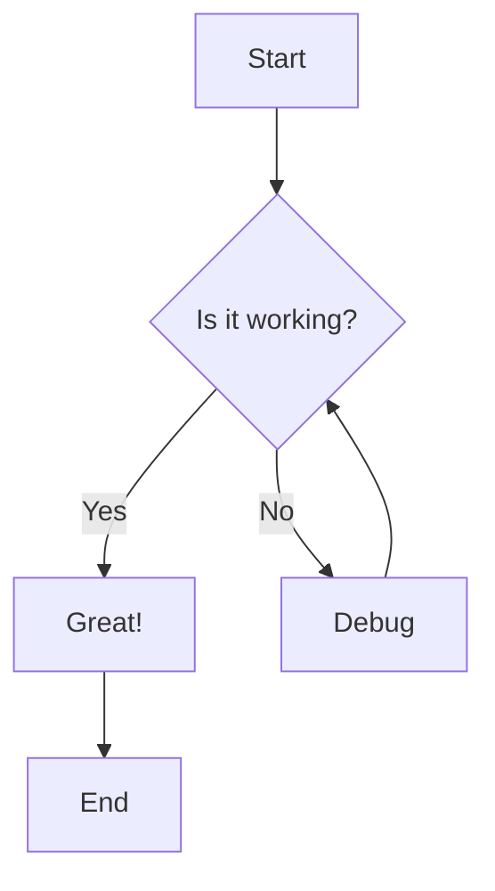
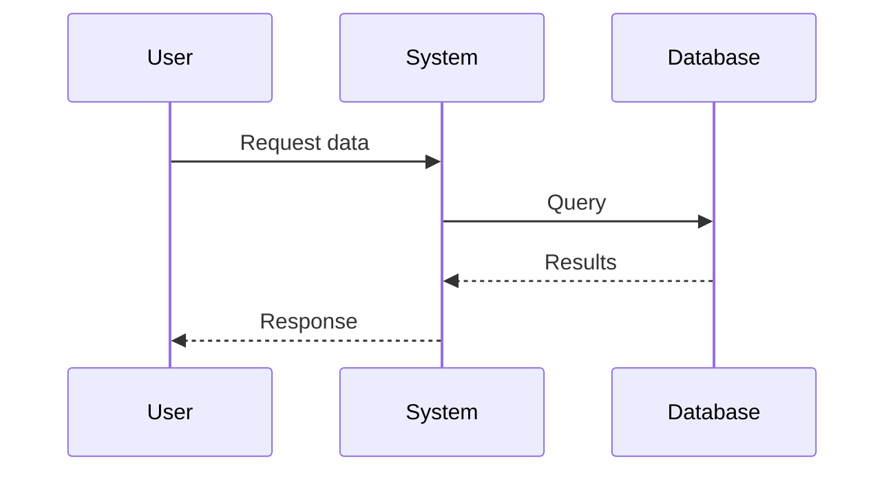
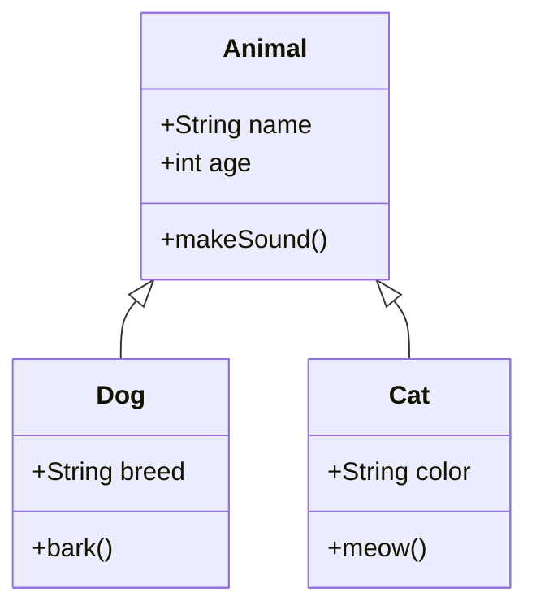
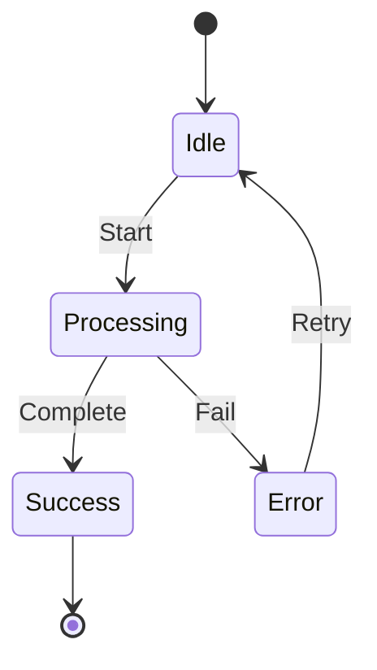
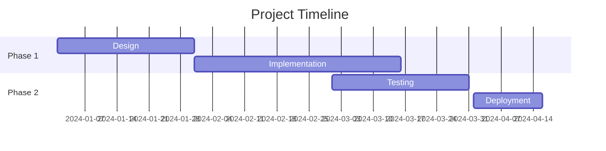
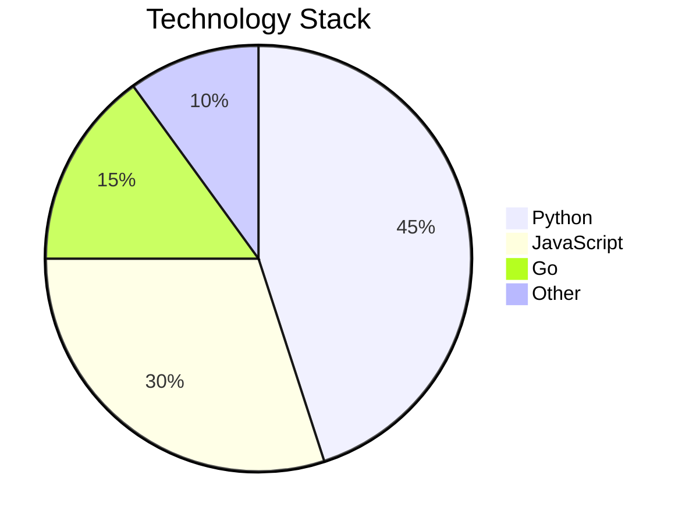
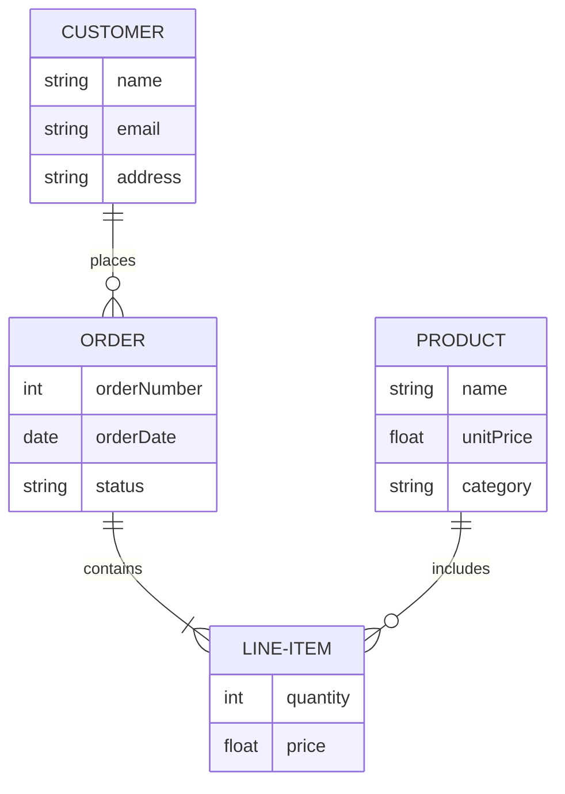
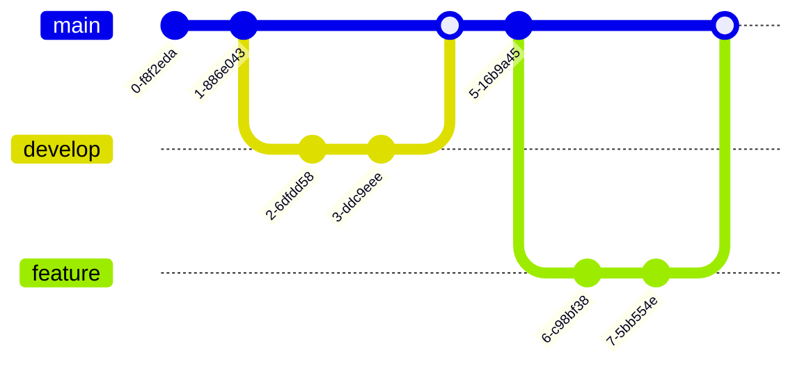
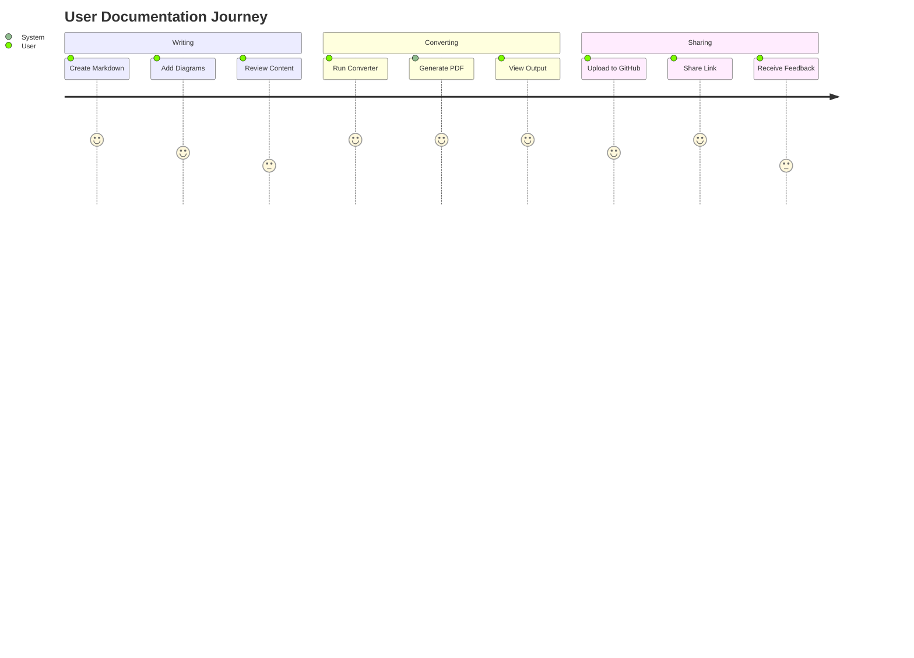

# Mermaid Diagram Examples

This document demonstrates various Mermaid diagram types that can be rendered to PDF.

## Flowchart

## Sequence Diagram

## Class Diagram

## State Diagram

## Gantt Chart

## Pie Chart

## Entity Relationship Diagram

## Git Graph

## User Journey

## Regular Markdown Content

The above diagrams demonstrate the various types of visualizations you can include in your markdown documents. When converted to PDF, these will be rendered as static images while maintaining their clarity and structure.

### Benefits of Mermaid Diagrams

1. **Version Control Friendly**: Diagrams are defined in text
2. **Easy to Update**: No need for external drawing tools
3. **Consistent Styling**: Automatic styling based on theme
4. **Documentation as Code**: Keep diagrams with your documentation