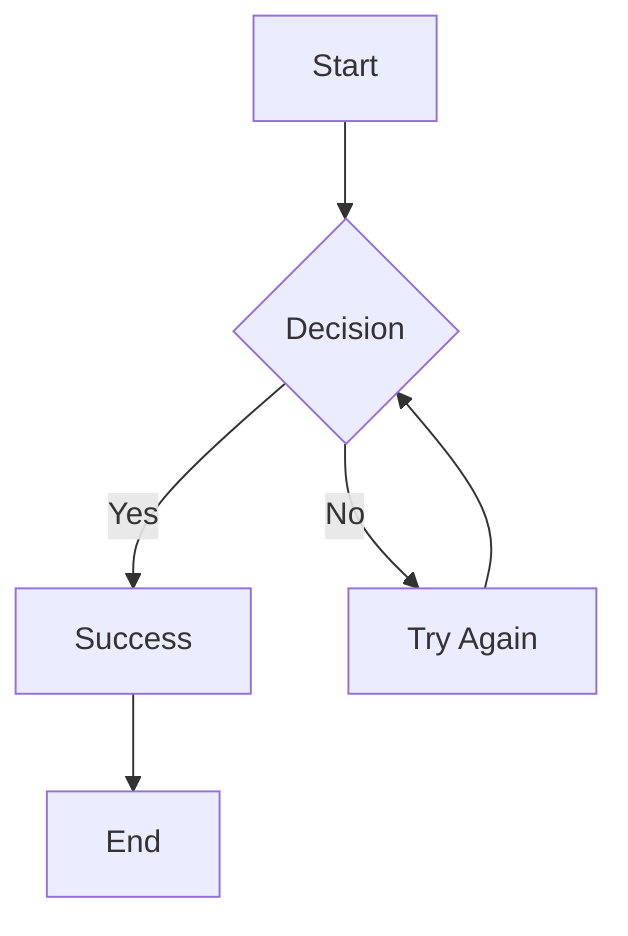

# Basic Flowchart

A simple flowchart with no HTML labels or special features.

```mermaid
graph TD
    A[Start] --> B{Decision}
    B -->|Yes| C[Success]
    B -->|No| D[Try Again]
    D --> B
    C --> E[End]
```
