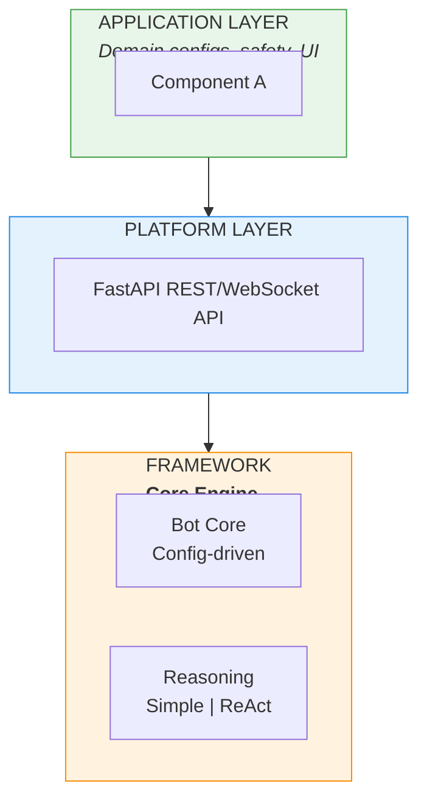

# HTML Labels Flowchart

Tests HTML label features: line breaks, italic, bold, and style directives.

```mermaid
graph TB
    subgraph app["APPLICATION LAYER<br/><i>Domain configs, safety, UI</i>"]
        a1["Component A"]
    end

    subgraph platform["PLATFORM LAYER"]
        p1["FastAPI REST/WebSocket API"]
    end

    subgraph framework["FRAMEWORK<br/><b>Core Engine</b>"]
        f1["Bot Core<br/>Config-driven"]
        f2["Reasoning<br/>Simple | ReAct"]
    end

    app --> platform --> framework

    style app fill:#e8f5e9,stroke:#43a047
    style platform fill:#e3f2fd,stroke:#1e88e5
    style framework fill:#fff3e0,stroke:#fb8c00
```
