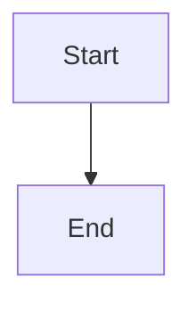
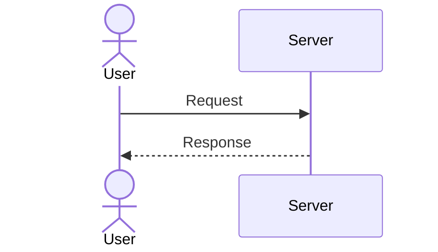
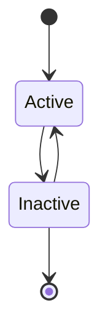

# Multi-Diagram Document

Tests multiple diagrams in a single document. Each should get unique SVG IDs.

## Flowchart

```mermaid
graph TD
    A[Start] --> B[End]
```

## Sequence Diagram

```mermaid
sequenceDiagram
    actor User
    participant Server
    User->>Server: Request
    Server-->>User: Response
```

## State Diagram

```mermaid
stateDiagram-v2
    [*] --> Active
    Active --> Inactive
    Inactive --> Active
    Inactive --> [*]
```
