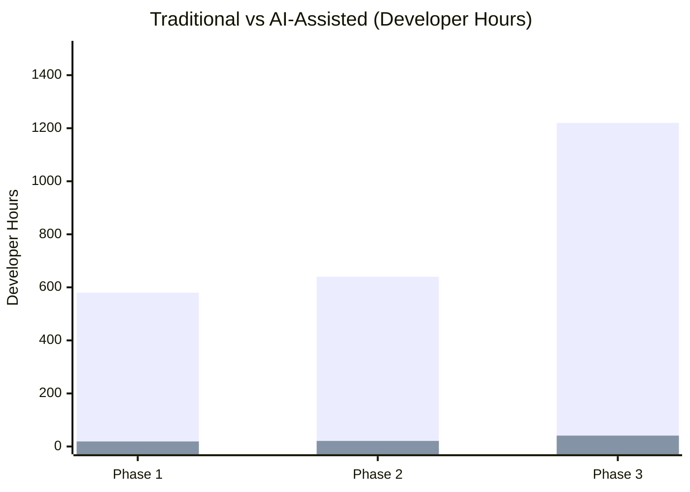

# XY Chart

Tests xychart-beta diagram type support.

```mermaid
xychart-beta
    title "Traditional vs AI-Assisted (Developer Hours)"
    x-axis ["Phase 1", "Phase 2", "Phase 3"]
    y-axis "Developer Hours" 0 --> 1500
    bar [580, 640, 1220]
    bar [19, 21, 41]
```
